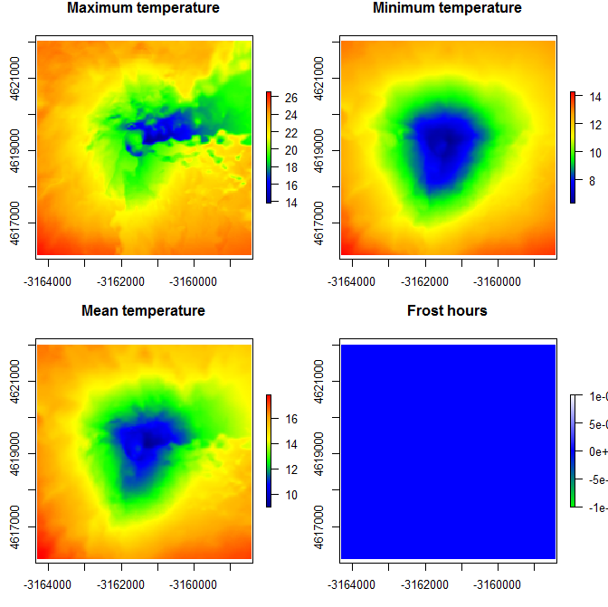
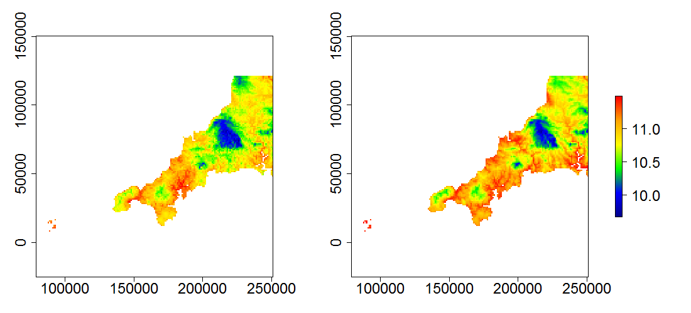

```{r setup, include=FALSE}
knitr::opts_chunk$set(echo = TRUE)
```


## Introduction
This vignette describes how to run the R package `microclima` in fully-automated mode to generate fine-resolution hourly estimates of temperature for anywhere on Earth. It is a supplement to the vignette runningmicroclima.pdf, which describes the basic workings of the package and how to run `microclima` manually for bespoke regions (see also Maclean *et al.* 2018).

## Overview
Fully-automated microclimate modelling is evoked by calling function `runauto`, which must have the following inputs: (1) a raster object defining the extent and resolution for which microclimate temperature data are required; (2) start and end dates for the period over which microclimate data are required; (3) the height above or below ground for which temperature estimates are required; (4) either a specified habitat type, or parameters that quantify describe canopy shading and leaf orientations. Details of this and optional additional inputs are provided below. Throughout, times are in UTC rather than local time. 

Upon calling the function, the following workflow is evoked:

1.	A digital elevation dataset is downloaded from [Registry of Open Data on AWS](https://registry.opendata.aws/). The dataset is used to calculate terrain and elevation effects on microclimate. If the specified resolution is <100m, then additional 100 m resolution DEM is downloaded for mesoclimate modelling. 

2.	Six-hourly ~2° grid resolution climate and radiation data and daily precipitation data are downloaded from NOAA’s National Centers for Environmental Prediction. 

3.	Six-hourly data are interpolated to hourly values.

4.	The fine spatial resolution DEM is used to provide terrain adjusted radiation estimates and to apply a topographic shelter coefficient to wind speeds.

5.	Elevation and cold-air drainage effects on temperature are applied. 

6.	Optionally, coastal effects are calculated. Sea-surface temperature data are downloaded, and coastal temperature adjustments applied by calculating coastal exposure and land-sea temperature gradients.

7.	The resulting data are passed to the `NicheMapR` package so that model calibration coefficients can be calculated. `NicheMapR` provides estimates of microclimate from first principles removing the need to obtain field data for model calibration. However, the routines for downscaling radiation, wind speed and calculating mesoclimate effects are not as sophisticated as in microclima, hence this is performed in microclima first.

8.	Outputs from `NicheMapR` are used to derive model coefficients, and the model is run in hourly time-steps. Model calibration is performed prior to accounting for vegetation cover. The effects on radiation of vegetative shading are applied after calibration, but prior to running the model.

9.	Upon running the model, a list object is returned with the following elements: (i) an array of temperatures for each grid cell and hour, (ii) an extent object defining the spatial extent over which the model was run, (iii) a POSIXlt object of hours over which the model is run, (iv) a character vector describing the units of temperature (usually °C), (v) a raster object of maximum, mean and minimum temperatures and frost hours.

## Example
```{r example1, message=FALSE, eval = FALSE}
library(raster)
library(NicheMapR)
library(microclima)
# Get dem for Pico, Azores
r <- microclima::get_dem(lat = 38.467429, long = -28.398995, resolution = 30)
# Takes ~ c. 5 minutes to run
temps <- microclima::runauto(r, "10/06/2010", "15/06/2010", hgt = 0.1,
                                  l = NA, x = NA, 
                                  habitat = "Barren or sparsely vegetated")
```

This should result in the following plot showing mean temperatures, frost hours and extremes in temperature.

```{r fig1, echo=FALSE, fig.cap="**Fig.1. Default example datasets produced and plotted by `runauto`.**", out.width = '70%', fig.align="center"}

```

## Digital elevation data

This step can also be carried out using `get_dem`. The underlying data sources are listed [here](https://github.com/tilezen/joerd/blob/master/docs/data-sources.md). 30 m grid resolution data is available for all terrestrial regions with the exception of Antarctica. Three metre resolution data are available for the Arctic and for parts of the UK and North America. If the resolution of data requested is finer than that available, elevations are derived by interpolation. Bathymetry is also returned automatically, so the user can specify a sea-level height, to which elevations below this height are set. If latitude and longitude coordinates are supplied to the `get_dem` function, the returned raster has a Mercator Coordinate Reference System if the specified latitude is between 80 degrees S and 84 degrees N. In polar regions WGS 84 / NSIDC Sea Ice Polar Stereographic projections are used. Alternatively a raster covering the desired extent can be supplied to `get_dem`, in which case the returned raster has the same resolution, extent and coordinate reference system as the supplied raster.

## Climate forcing data

This step can also be carried out using function `get_NCEP` and `dailyprecipNCEP`. The latter retrieves daily rainfall from the National Centers for Environmental Prediction, and data are used to calculate soil moisture and adjust the thermal properties of soil accordingly during the model calibration process. The former downloads the following climate datasets: (i) the observation times (note, data for periods either side of the specified start and end of the input time sequence are returned to aid with interpolation); (ii) mean, maximum and minimum temperatures at 2 m above ground; (iii) specific humidity at 2 m, (iv) surface pressure; (v) u and v wind vector at 10 m; (vi) downward and upward longwave radiation fluxes, (vii) downward shortwave radiation fluxes; and (viii) total cloud cover.

## Hourly interpolation

This step can also be carried out using `hourlyNCEP`. Pressure, specific humidity and u and v wind vectors are interpolated to hourly using a spline function. Wind speed and direction are then calculated from the u and v vectors, and wind speed height-adjusted from 10 m to 2 m using `windheight`, which assumes a logarithmic height profile in wind speed. Radiation is interpolated by first calculating the proportion of extra-terrestrial reaching the surface, and then correcting this by solar altitude-dependent atmospheric-thickness to derive a measure of the optical depth (opacity) of the atmosphere. Opacity is then spline interpolated to hourly and then back-corrected to hourly estimates of solar radiation, adjusted for solar-altitude dependent atmospheric thickness, thus reproducing realistic diurnal cycles in the flux intensity of radiation. The proportion of direct and diffuse radiation are then estimated using `difprop`. Emissivity is derived from the ratio of incoming and outgoing long-wave radiation, and interpolated to hourly. Hourly temperatures are derived using `hourlytemp`, which applies a sinusoidal function to daily maxima and minima to reproduce typical diurnal cycles in radiation and by permitting temperature to vary from these diurnal cycles as a function of incoming shortwave radiation and emissivity (Fig. 2).

```{r fig2, echo=TRUE, warning=FALSE, fig.cap="**Fig.2. Typical temperature profile over a 48 hour period, calculating from daily maxima and minima using the `hourlytemp` function.**", fig.align="center"}
library(microclima)
jd <- julday(2010, 5 , c(1,2))
ht <- hourlytemp(jd, NA, microvars$humidity[1:48], microvars$cloudcover[1:48],
                 microvars$pressure[1:48], dni = microvars$dni[1:48],
                 dif = microvars$dif[1:48], c(7.5, 7.2), c(14.6, 15.2),
                 49.968, -5.216)
par(mar=c(5,5,5,5))
plot(ht ~ c(0:47),type="l", 
     xlab = "Hour", 
     ylab = "Temperature",
     main = paste("tmins:", 7.2, 7.5, "tmaxs:", 14.6, 15.2),
     cex.lab = 1.4,
     cex.axis = 1.3,
     cex.main = 1.4)
```
## Terrain adjustments and coastal effects

This step can also be carried out using `microclimaforNMR`. The following terrain adjustments are applied. First, longwave and shortwave radiation are adjusted for the effects of slope, aspect, topographic shading and sky-view. Next a wind-direction dependent topographic sheltering coefficient is applied to wind speeds using `windcoef`. Third, adiabatic lapse-rates are calculated using `lapserate` and applied to the hourly temperature data. Lastly, cold-air drainage effects are optionally calculated and applied using `pcad` and `cadconditions`. 

Coastal effects are applied by downloading sea-surface temperature data, computing land–sea temperature differences and the degree of coastal exposure both upwind and in all directions. Coastal exposure is measured using an inverse-distant weighted measure of the number of land and sea pixels in a specified direction. To speed up calculations, this is performed using C++ code included with the `microclima` package. Coastal effects can also be calculated in isolation using `coastalNCEP` and together with elevation adjustments, provide the mesoclimatic reference temperature data needed to drive the microclimate model (Fig. 3). Planned improvements to the model, include the capacity to model the effects of large inland water bodies.

```{r fig3_code, echo=TRUE, eval=FALSE}
library(raster)
library(microclima)
e <- extent(79000, 251000, 4000, 121000)
r <- raster(e)
res(r) <- 1000
crs(r) <- "+init=epsg:27700"
dem <- get_dem(r, resolution = 1000)
ll <- latlongfromraster(r)
tme <-as.POSIXlt(0, origin = "2017-01-07", tz = "GMT")
mnmr <- microclimaforNMR(ll$lat, ll$long, "07/01/2017", "07/01/2017", 
                         l = 0, x = 1, dem = dem, plot.progress = FALSE)
# calculate and apply elevation effects in each hour
aout <- mnmr$acoast # array of coastal effects
for (hr in 1:24) {
  aout[,,hr] <- aout[,,hr] + is_raster(dem) * mnmr$tref$lapserate[hr]
}

# code to produce plot of mean temperatures using NCEP data
meantemp <- if_raster(apply(aout, c(1,2), mean), dem)
mypal <- colorRampPalette(c("darkblue", "blue", "green", 
                            "yellow", "orange", "red"))(255)
plot(meantemp, col = mypal)
```

```{r fig3, echo=FALSE, fig.cap="**Fig.3. Side-by-side comparison of a 1 km gridded dataset of mean temperature on 7th January 2017 derived from the UK Met Office (left) and a dataset derived by applying elevation and coastal effect adjustments to ~200 km resolution NCEP data as described above (right).**", out.width = '100%', fig.align="center"}

```

## NicheMapR model calibration

`NicheMapR` uses sophisticated procedures to derive microclimate temperatures from first principles, but the `microclima` package uses a simpler fitting procedure in which the above-ground temperature anomaly from reference temperature (ΔT) is modelled as follows as a function of net radiation and wind speed and below-ground temperatures are derived from temperature in the previous time step and heat exchanges with the soil surface and underlying soil layers. Parameters that define these relationships are unknown and in the un-automated version of the model must be derived using field data. 

In the automated version, a time-series of temperature data for a point located at the centre of the input raster to `runauto` is derived from first principles using the NicheMapR, package (Kearney & Porter 2017) using the outputs of `microclimaforNMR` as an input to NicheMapR. The resulting data are then used to derive coefficients for the running the model, in effect treating outputs form NicheMapR as field temperature measurements. 

## Vegetation and canopy shading

Vegetation affects microclimate, principally by influencing the amount of radiation reaching locations below the canopy. From Campbell (1986), two characteristics are assumed affect transmission of radiation through the canopy: a parameter *l*, the leaf area index, which affects the overall degree of shading, and a parameter *x*, describing the distribution of leaf angles, which in turn affects transmission when the sun is directly overhead relative to higher zenith angles (vertically orientated leaves block out a higher proportion of radiation when the sun is low on the horizon). The parameter is more formally defined as the ratio of vertical to horizontal projections of leaf foliage, tending towards 0 for horizontal leaves, 1 for spherical distributions (e.g. deciduous woodland) and ∞ for vertically orientated leaves such as grasses. 

When using `runauto` vegetation / canopy effects can be provided as inputs in a number of ways. Firstly by specifying the parameters *l* and *x*, or alternatively by specifying habitat type(s). If specifying *l*, the input can be provided as a single value, vector, matrix, raster or array. If a single value is provided, spatially uniform and time-invariant leaf areas are assumed throughout the study area. If provided as a vector, spatially uniform, but time variant values are assumed and a value must be specified for every hour. If provided as a matrix or raster, time-invariant but spatially variant leaf area is assumed, and values must be provided for every grid cell over which the model is run. If provided as an array, time- and space-variant leaf areas are assumed and values must be provided for every pixel and hour. 

If specifying *x*, the input can be provided as a single value, matrix or raster. If a single value is provided, spatially uniform leaf distribution angles are assumed throughout the study area, whereas if provided as a matrix or raster, spatially variable values are assumed and values must be provided for every grid cell over which the model is run. Varying *x* through time is not supported.

Alternatively the user can specify one of one of the 17 habitat types as specified by the inbuilt dataset `habitats`. Here, a typical values of *x* and *l* associated with that habitat are assumed, and *l* is seasonally adjusted based on location (Fig. 4). This step can also be carried out using `laifromhabitat`. The `laifromhabitat` function also provides the option to include climatic variables as inputs, thereby explicitly accounting for temperature and rainfall-dependent leaf phenology. The seasonal adjustment procedure has been calibrated against MODIS-derived estimates of leaf area from a wide variety of locations across the globe, but further improvements to these procedures are anticipated. Typical values of *x* associated with each habitat type were derived from literature. Habitat type(s) can be provided as a single value or a matrix or raster. If a single value is provided, the same habitat type is assumed throughout the study area, whereas if provided as a matrix or raster, spatially variable habitat types are assumed and values must be provided for every grid cell over which the model is run.

```{r fig4, echo=TRUE, fig.cap="**Fig. 4. Seasonal changes in leaf area index values derived using the `laifromhabitat` function for deciduous broadleaf forest (red) and short grassland (blue) in Cornwall, UK (50.0° N, 5.2°W).**", out.width = '60%', fig.align="center"}
library(microclima)
# deciduous broadleaf forest
dbf <- laifromhabitat(4, lat = 50, long = -5.2, year = 2015)
# short grassland
sg <- laifromhabitat(10, lat = 50, long = -5.2, year = 2015)
par(mar=c(5,5,5,5))
plot(dbf$obs_time, dbf$lai, type = "l", col = "red", lwd = 2.5,
     xlab = "Month",
     ylab = "Leaf Area Index (LAI)",
     cex.lab = 1.8,
     cex.axis = 1.5)
lines(sg$obs_time, sg$lai, col = "blue", lwd = 2.5)
```

The model corrects for shading at the height above the ground for which microclimate estimates are required. If estimates are above the height of that vegetation type (e.g. if required for one metre over short grassland), then no canopy shading is assumed. If > 0 and < canopy height, then the shading is adjusted by assuming a vertically uniform distribution of shading. E.g. leaf area is halved if the microclimate estimates are required at 50 cm, in vegetation that is one m tall.

## Snow cover

Snow cover effects are currently unaccounted for in `microclima`, but a basic snow model is included with `NicheMapR`. If users wish to account for snowcover, we recommend, as an interim solution, running `NicheMapR` for point locations and driving gridded surfaces via spatial interpolation.

## Additional optional inputs to `runauto`

```{r parameter_table, echo = FALSE}
thing <- c("`use.raster`", "`coastal`", "`CAD`", "`r.is.dem`", "`hourlydata`",
           "`dailyprecip`", "`albg`", "`albr`", "`albc`", "`mesoresolution`",
           "`zmin`", "`windthresh`", "`emthresh`", "`reanalysis2`", "`steps`",
           "`plot.progress`", "`continuous`", "`summarydata`", "`save.memory`")
description <- c("Logical value indicating whether to use the input raster `r` in the calculation of coastal effects. If used, NAs or values corresponding to `zmin` must represent sea",
                 "Logical value indicating whether or not to calculate coastal effects. The model is faster if set to false. Coastal effects often extend 1000s of kilometres inland, but their effects diminish with distance from the sea. If the distance of the study site from the coast exceeds 500 km, the coastal effects will be picked up in the NCEP data, and are likely to be fairly uniform across 100km x 100 km regions.",
                 "Logical value indicating whether or not to calculate cold air drainage effects. The model is faster if set to false. Cold air drainage effects are most prevalent in mountainous terrain where nigh-time clear sky conditions are common.",
                 "Logical value indicating whether the input raster `r` is a digital elevation dataset that should be used for calculating microclimatic effects. If FALSE, then a digital elevation dataset is downloaded.",
                 "Data frame of hourly climate data as returned by `hourlyNCEP`. Providing this dataset greatly expedites running the model if model outputs are required for multiple study locations within the same ~ 200 x 200 km NCEP grid cell. It also allows the user to replace automatically retrieved climate forcing data with locally sourced climate forcing data, which in many circumstances will improve model performance particularly over meso-climatic extents.",
                 "Data frame of daily precipitation data as returned by `dailyprecipNCEP`. Providing this dataset expedites running the model if model outputs are required for multiple study locations within the same ~ 200 x 200 km NCEP grid cell. It also allows the user to replace automatically retrieved precipitation data with locally sourced data, which will improve the model performance in instances where seasonal variation in soil moisture is high.",
                 "Single value, raster object, two-dimensional array or matrix of values representing the albedo(s) of the ground as returned by `albedo2`. If a single numeric value is provided, the same ground albedo is assumed throughout. If a raster object, two-dimensional array or matrix of values is provided, spatially variable ground albedo is assumed and values must be provided for each grid cell over which the model is run. Providing values improves handling of solar radiation absorbed by the ground, and allows better handing of ground surface effects on microclimatic temperatures, for example warmer temperatures in areas with dark surfaces.",
                 "Single value, raster object, two-dimensional array or matrix of values representing the albedo(s) of adjacent surfaces from which radiation is reflected as returned by `albedo_reflected`. If a single numeric value is provided, the same albedo is assumed throughout. If a raster object, two-dimensional array or matrix of values is provided, spatially variable albedo is assumed and values must be provided for each grid cell over which the model is run. The effects of reflected radiation on microclimate temperatures are fairly negligible, so model results are not strongly influenced by this parameter.",
                 "Single value, raster object, two-dimensional array or matrix of values representing the albedo(s) of the canopy as returned by `albedo2`. If a single numeric value is provided, the same ground albedo is assumed throughout. If a raster object, two-dimensional array or matrix of values is provided, spatially variable ground albedo is assumed and values must be provided for each grid cell over which the model is run. Providing values improves handling of the effects of longwave radiation absorbed and re-emitted by vegetation canopies.",
                 "Numeric value indicating resolution of the digital elevation dataset to be downloaded and used for modelling mesoclimatic modelling.",
                 "Assumed sea-level height. In automated download of digital elevation data, bathymetry (elevation below sea-level) is also returned, so this parameter allows the user to specify a sea-level height, to which elevations below this height is set when calculating topographic effects and to differentiate sea from land in calculating elevation effects.",
                 "Threshold wind value (m /s) above which cold air drainage is assumed not to occur. Ignored if `CAD` is FALSE.",
                 "Threshold emissivity value above which cold air drainage is assumed not to occur. Ignored if `CAD` is FALSE.",
                 "Logical indicating whether climate forcing data should be downloaded from the NCEP Reanalysis II project (default) or from Reanalysis I (data prior to 1979). Reanalyses II are marginally more accurate, but only extend back to 1979. Reanalyses I data are available from 1948.",
                 "Coastal effects are calculated in specified directions upwind. Steps is an integer that defines the total number of directions used. If the default 8 is specified, coastal effects are calculated at 45º intervals (i.e. 360 / 8).",
                 "Logical indicating whether to produce plots to track progress. If true, coastal exposure in each direction, coastal and elevation effects at 500 hour intervals and microclimate model outputs at 100 hour intervals are plotted. Summary data plots are also produced.",
                 "Logical value indicating whether to treat wind speed as a continuous variable when deriving local temperature anomalies. See `fitmicro` for details",
                 "Optional logical indicating whether to calculate summary data (frost hours and maximum, minimum and mean temperature) for each pixel and return these to the output.",
                 "An optional logical indicating whether to save memory by storing hourly temperature x 1000 as an integer values. One of the constraining factors in running microclimate models in R using `microclima` is that the array of hourly temperatures are stored in internal memory, which for most PCs is <=64GB. In consequence, there is a limit to the number of grid cells over which the model can be run. Typical memory requirements for a year of hourly data are provided in Table 1. For regions much greater than 200 x 200 grid cells, we recommend running the model as partially overlapping tiles.")

df <- data.frame(option = thing, description = description)

knitr::kable(df, caption = "")
```

```{r memory_table, echo = FALSE}
option <- c("Study area size (grid cells)", "`save.memory` = FALSE",
            "`save.memory` = TRUE")
sizes <- c("100 x 100", "200 x 200", "400 x 400", "800 x 800", 
           "1000 x 1000", "2000 x 2000", "4000 x 4000",
           "8000 x 8000")
memory_f <- c("670 MB", "2.63 GB", "10.5 GB", "41.9 GB", "65.4 GB",
            "262 GB", "1.02 TB", "4.10 TB")
memory_t <- c("335 MB", "1.31 GB", "5.24 GB", "21.0 GB", "32.8 GB",
              "131 GB", "524 GB", "2.05 TB")

df2 <- data.frame("Study area size (grid cells)" = sizes,
                 "`save.memory` = FALSE" = memory_f,
                 "`save.memory` = TRUE" = memory_t)

colnames(df2) <- option

knitr::kable(df2, caption = "Table 1: Internal memory (RAM) requirements to run the model for one year, providing 8760 hourly values for each grid cell. Most standard desktop PCs currently have ~8GB RAM.")
```

## References
Campbell GS (1986) Extinction coefficients for radiation in plant canopies calculated using an ellipsoidal inclination angle distribution. *Agr Forest Meteorol* 36: 317-21.

Kearney MR, Porter WP (2017) NicheMapR– an R package for biophysical modelling: the microclimate model. *Ecography*, 40: 664-74.

Maclean IMD, Mosedale JR, Bennie JJ (2018) Microclima: An R package for modelling meso- and microclimate. *Methods Ecology Evol* 10: 280-90.
